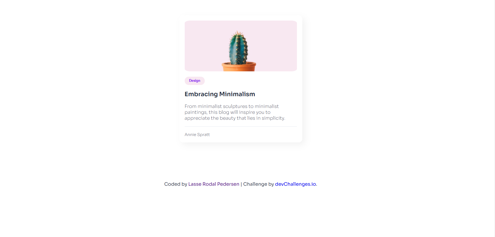
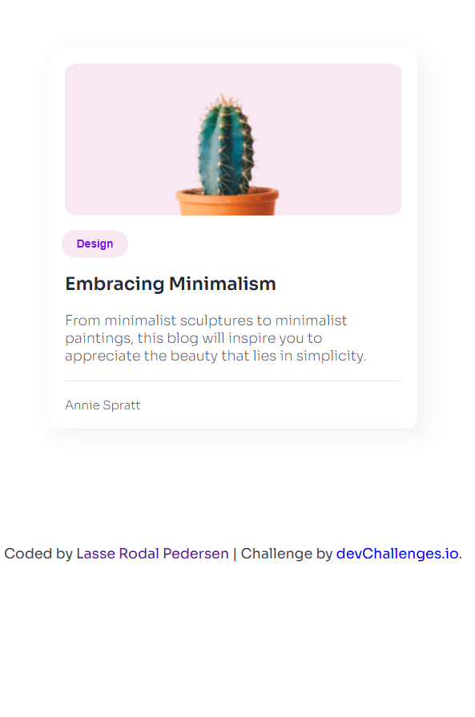

<h1 align="center">{Minimal Blog Card} | devChallenges</h1>

   Solution for a challenge <a href="https://devchallenges.io/challenge/minimal-blog-card" target="_blank">Minimal Blog Card</a> from <a href="http://devchallenges.io" target="_blank">devChallenges.io</a>.

  <h3>
    <a href="https://lasse-rodal.github.io/Minimal-blog-card/">
      Live Demo
    </a>
     | 
    <a href="https://github.com/Lasse-Rodal/Minimal-blog-card">
      Solution
    </a>
     | 
    <a href="https://devchallenges.io/challenge/minimal-blog-card">
      Challenge
    </a>
  </h3>

## Table of Contents

- [Overview](#overview)
  - [The challenge](#the-challenge)
  - [Screenshot](#screenshot)
  - [Links](#links)
- [My process](#my-process)
  - [Built with](#built-with)
  - [What I learned](#what-i-learned)
- [Author](#author)

## Overview

This application/site was created as a submission to a [DevChallenges](https://devchallenges.io/challenges-dashboard) challenge.

### The challenge

create a web page that displays a blog card.

### Screenshot

  
Desktop version

  

  
Mobile version

  

  
Active version

  

### Links

- [Solution URL:](https://github.com/Lasse-Rodal/Minimal-blog-card)
- [Live Site URL:](https://lasse-rodal.github.io/Minimal-blog-card/)

## My process

### Built with

HTML: 
- Basic structure with semantic elements

CSS:
- Grid Layout
- Flexbox
- Mobile-first approach: The design adapts to different screen sizes
- CSS Transitions
- Hover Effects, Button scaling on hover
- Google Fonts
- Responsive Design

### What I learned

I learned how to create a minimalist, responsive web page using semantic HTML, CSS Grid, Flexbox, and hover effects, while also incorporating custom fonts and a mobile-first approach.

## Author

- Github - [Lasse Rodal Pedersen](https://github.com/Lasse-Rodal)
